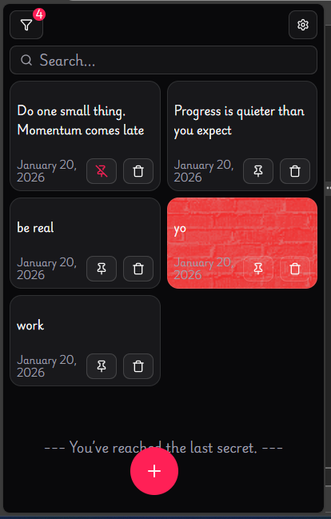

## 🔴 Demo

### 🔴 🖼️ Screenshot

### 🔴 🎥 Video

[Notes - 23-01-2026.webm](https://github.com/user-attachments/assets/8afe9ded-c1a5-4208-9565-64d6343029a0)

⬇️ <a href="frontend/public/app-demo/Notes-23-01-2026.webm" download="Notes-by-pri.webm">
  Download Demo Video
</a>

### 🔴 ↗️ Link
https://pridebnath.github.io/Notes

 
---

# Notes

**A calm, beautiful place to keep thoughts worth revisiting.**

Notes turns your ideas, quotes, and short writings into a personal library you enjoy browsing — not just storing.

---

## What you get

* **Card-based notes** that feel inviting and easy to read
* **Custom backgrounds & themes** to match your mood
* **Clean, distraction-free writing** with focus on your words
* **Simple organization** using tags, filters, and sorting
* **Fast, local-first performance** that stays smooth as you grow

---

## Great for

* Readers saving meaningful quotes
* Writers collecting ideas and snippets
* Thinkers and journalers who enjoy short-form notes

---
## 📱 Android App

⬇️ **Latest APK:**  
(Updated automatically)

